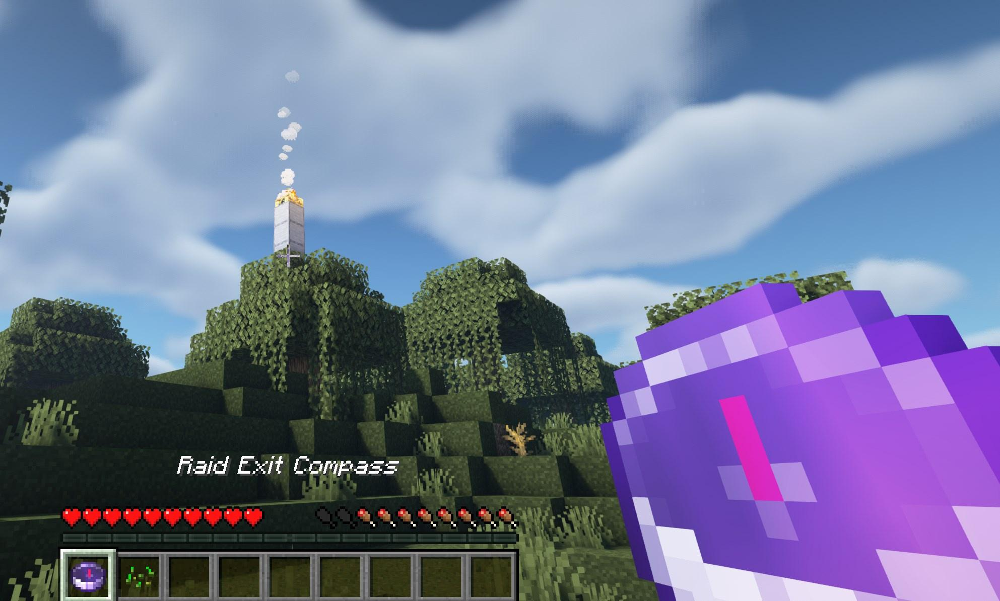

# Difficulty Scaler

Improves Minecraft's CO-OP experience by dynamically increasing the difficulty of the game based on the number of people online.

Also introduces a set of new mechanics that increases the challenge of staying alive.

# List of features

## Raids

Players can form raiding groups and go on raiding incursions into another world in search of treasure. Raids have a time limit; before the time is up, players must have reached the exit location pointed to by the compass. Only the raid leader will spawn with the exit point compass, so make sure to follow the leader, or else you will most likely not manage to locate the exit point.

The exit point is unbreakable and can be identified by a campfire on top of a stone tower. The exit point is always on the surface of the world. To exit, right-click the campfire. All raid team members must be nearby, or else exiting will fail. Upon exit, raid-specific items get removed from the player's inventory, e.g., the leader's compass.

Throughout the raid, the player will be notified of the remaining raid time at a 5 minutes interval. In addition, a countdown that announces every minute starts when 5 minutes remain.

A restriction has been set for how many blocks a player can break within a raid to make adventuring the most viable strategy. However, this restriction does not apply to valuable blocks like iron ore. The idea is to restrict the power of strip mining while pushing the player toward cave exploration.

Enemies will deal more damage during a raid. They are more likely to slow you as well. On top of that, zombies do not burn in daylight, and other miscellaneous modifications have been added to make the raid more exciting. As a reward, the player will find valuables at an increased rate.

Commands:
- !raid join #name  
  - Joins (or creates) raid identified by #name. E.g. !raid join 123
- !raid leave
    - Leaves current raid. Leaving raid while it's ingoing results in instantaneous death.
- !raid start
    - Starts the raid you are currently part of. Only the leader may start a raid.

## Server-wide voting

Players can vote for different things to happen to the server and world. For a vote to pass, all players online must have voted on the same vote session. A vote session is e.g. voting for daytime or server restart. It is possible to auto-vote on some vote sessions. If you have auto-vote enabled on a session, any player can perform an ordinary vote to trigger the vote to pass. You will then automatically be counted as a voted player.
Auto voting is persistent across server-restarts.

Current vote sessions enabled:

- Daytime (!day or !auto day)
- Restart (!restart)

## Automated Restarts

- Server automatically restarts to prevent lag from increased number of mobs.

## General Difficulty Scaling

All systems that increase the difficulty of the world scale with the number of players online. 

This means that the more players that are online, the higher the chance for acid rain, the more monsters will spawn, and so on.

### Server Phase

The server progresses through 7 phases before being reset to the starting phase. The higher the phase, the more difficult the server gets. This affects most systems on the server. Whenever a phase change occurs, it is advertised on the server.

## Acid Rain

There is a small chance that a server-wide acid rain event occurs when the world naturally starts raining. 

When this event begins the players will be notified in the server chat.

While the player is out of cover and hit by rain the player will take damage.

## Meteor Rain

There is a small chance that a server-wide wide meteor rain event occurs. The meteor rain does not damage blocks or entities but just players.

When this event begins the players will be notified in the server chat.

If a player is struck by a meteor, the player will take damage and be launched away from the point of impact. 

## Revive System

When a player takes damage that would normally kill the player, the player will be given a second chance to survive by becoming "downed". When this happens, the player will be rooted in place, and a bleed out timer will start. When the player's health reaches zero, he or she will die.
Disconnecting while downed will result in instantaneous death. This can only happen so often and requires another player to nearby for the downed event to occur.

In the image above, a revivable player can be seen. 

Any other player can save the player by running up to the player and right-clicking on the Minecraft character. A player can be identified as downed by the blood particles occasionally showing up as the downed player bleeds out.

## Automatic sapling planting

- When destroying a tree, there is a chance for saplings to automatically be planted at the broken block location. This prevents deforestation of the server.

## Torch placement restriction

- Ordinary torches can not be placed at a certain depth but instead redstone torches must be used.

## Monster spawner

- Monster spawns have a chance of dropping as a pickable block when destroyed by a silk-touch enchanted pickaxe.

## Powered Rails

- Increased speedup per power rail.

## Monster Changes

### General

- Dynamically increase the number of monster spawns based on the current server phase.
- Dynamically increase the monster damage based on the number of people online.

- A subset of monsters spawning at the surface have their movement speed greatly increased. E.g. for zombies.

### Monster equipment

- The further down into the world monsters are spawned, the better equipment they can spawn with. This means that at the top level of the map, a monster has a chance to spawn with leather, but at the bottom, they have a chance to spawn with diamond equipment.

- Skeletons can spawn with special bows. These bows can have enchants such as knockback, fire damage, etc. 

### Monster Hordes

- There is a chance that a monster horde spawns. A horde results in twice the amount of monsters getting spawned.

### Skeleton

- Skeletons do not damage other monsters with their arrows.
- Skeletons have a chance to dodge player-shot arrows.

### Phantom

- No longer spawns.

### Zombie

- Slow zombies have a chance of slowing the player when the player gets hit.

### Spider

- There is a chance for a spider to evolve into a leaping spider. A leaping spider takes no fall damage and jumps toward the player when it is fighting.

- When a spider is killed, it has a chance to shoot webs around itself to prevent the player from quickly escaping.

### Creeper

- Creepers do not damage other nearby creepers when exploding.
- Creepers do not damage terrain when exploding on the surface.
- There is a chance for supercharged creepers to spawn naturally. These creepers have increased damage and explosion radius. You can identify them by their blue glow.

### Drowned

- Do not damage other drowned with thrown tridents.
- Have an increased chance of dropping a trident on death.

### Piglin

- Looking at a piglin in the Nether has a chance to make all nether piglins become hostile. Avoid eye contact at all costs.
